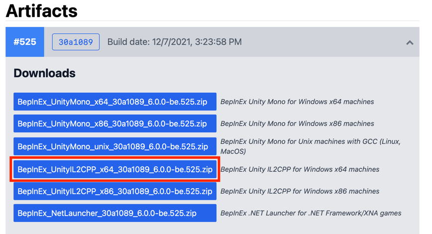

# CrabGame Cheat

A Cheat for [CrabGame](https://store.steampowered.com/app/1782210/Crab_Game/) by [DaniDev](https://www.youtube.com/c/DaniDev).

Click [here](https://youtu.be/19Igp2FsL6w) for the Showcase Video.

## DISCLAIMER
This software is for testing/educational purposes only. We do not encourage using it when you're not allowed, and will not bear liability for your actions.

## Installing/Updating with the Installer

### Installing
 1. Download the [CrabGame Cheat Installer](https://github.com/CodeName-Anti/CrabGame-Cheat/releases/latest/download/CrabGame_Cheat_Installer.exe).
 2. Open the Installer.
 3. Press the Install Button

### Updating
1. Download the [CrabGame Cheat Installer](https://github.com/CodeName-Anti/CrabGame-Cheat/releases/latest/download/CrabGame_Cheat_Installer.exe) if you haven't already.
 2. Open the Installer.
 3. Press the Update Button.

## Manual Installation
 1. Download the [lastest BepInEx Build](https://builds.bepis.io/projects/bepinex_be), the file name should start with "BepInEx_UnityIL2CPP".
    
 2. Download [imagesCrabGame_Cheat_BepInEx.dll](https://github.com/CodeName-Anti/CrabGame-Cheat/releases/latest/download/CrabCheat_BepInEx.dll)
 3. Extract the Zip archive in your Crab Game Installation Folder(Steam -> Right Click Crab Game -> Manage -> Browse local Files).
    
 4. **Start the Game** and then **close it** once you are in the Main Menu.
 5. Create a new Folder in "/BepInEx/plugins" (Will load after step 4) and name it "CrabGame Cheat", then copy the [CrabGame_Cheat_BepInEx.dll](https://github.com/CodeName-Anti/CrabGame-Cheat/releases/latest/download/CrabCheat_BepInEx.dll) into it.

## Features
 - **ClickGUI**
   - Activated by Right Shift.
 - **KeyBinds**
   - Allows features to be binded to keys in-game.
 - **AimBot**
   - Quickly aim onto the nearest player object with deadly accuracy.
 - **AirJump**
   - No longer limited to one jump until landed.
 - **AntiBoundKills**
   - Going out of bounds does not kill self.
 - **ClickTP**
   - Teleport self object to click destination. (Caution teleporting long distances causes other player objects to be launched) 
 - **ESP**
   - View spiderweb of all player object locations.
 - **ForceStart(LobbyOwner only)**
   - Instantly start the lobbies game without minimum ready ups.
 - **NoClip**
   - Allows no clipping of the self player object and simulates flying. (Caution flying in the beginning of the round at high speeds can cause other player objects to be launched.) 
 - **GlassBreaker**
   - Allows correct path to be seen by self on glass/ice jumping games. (Caution activating before the start of the round can cause ALL glass to break for self.)
 - **GodMode**
   - No Damage can be taken, object's don't cause knockback you like bats, snowballs. (Caution can still die by boundaries.)
 - **Mega Jump**
   - Allows much more generous jump height.
 - NoFall
 - NoFreeze
 - NoPush
 - **OwnerHighlight**
   - Highlights Lobby owner in orange silhouette. (Cation may need to toggle at the start of new rounds.) 
 - Reset Quest cooldown
 - Complete Quest
 - **Speed**
   - Increases self player movement speed. Use the slider to control the multiplier.
 - Infinity Punch
 - TriggerBot
 - ...and more to come

## Build setup
 1. Clone the Project.
 2. Run the LibCopy.cmd file to copy all CrabGame Libraries.
 3. Now you can build it yourself or modify it.
