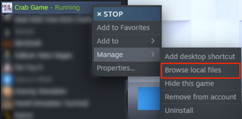
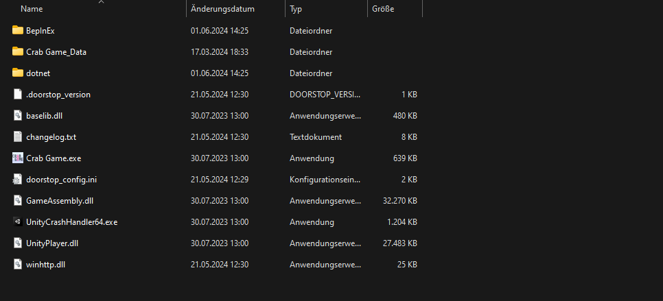

# CrabCheat

A Cheat for [CrabGame](https://store.steampowered.com/app/1782210/Crab_Game/) by [DaniDev](https://www.youtube.com/c/DaniDev).

## **DISCLAIMER**
**This software is for testing/educational purposes only. We do not encourage using it when you're not allowed, and will not bear liability for your actions.**

## Installing/Updating with the Installer

### Installing
1. Download the [CrabCheat Installer](https://github.com/CodeName-Anti/CrabGame-Cheat/releases/latest/download/CrabGame_Cheat_Installer.exe).
2. Open the Installer.
3. Press the Install Button

### Updating
1. Download the [CrabCheat Installer](https://github.com/CodeName-Anti/CrabGame-Cheat/releases/latest/download/CrabGame_Cheat_Installer.exe) if you haven't already.
2. Open the Installer.
3. Press the Update Button.

## Manual Installation
1. Download [BepInEx 6 bleeding edge](https://builds.bepinex.dev/projects/bepinex_be/691/BepInEx-Unity.IL2CPP-win-x64-6.0.0-be.691%2B3ba398f.zip).
2. Download [CrabCheat.dll](https://github.com/CodeName-Anti/CrabGame-Cheat/releases/latest/download/CrabCheat.dll).
3. Extract the Zip archive in your Crab Game Installation Folder(Steam -> Right Click Crab Game -> Manage -> Browse local Files).  

      
    Your Crab Game Installation Folder should look like this:
    

4. **Start the Game** and then **close it** once you are in the Main Menu.
5. Create a new Folder in "/BepInEx/plugins" (Will load after step 4) and name it "CrabCheat", then copy the [CrabCheat.dll](https://github.com/CodeName-Anti/CrabGame-Cheat/releases/latest/download/CrabCheat.dll) into it.

## Features

  
Player

- **AntiBoundKills**
  - Going out of bounds does not kill self. (usually means just floating above water, lava, etc.)
- **Anti Tag**
  - Prevents players from tagging and stealing the crown from you.
- **GodMode**
  - No Damage can be taken, objects don't cause knockback to you like bats, snowballs. (Caution you can still die by boundaries and snow balls in Dodgeball.)
- **NoFall**
  - Prevents fall damage from happening to you.
  

  

  
Movement

- **AirJump**
  - No longer limited to one jump until landed.
- **ClickTP**
  - Teleport yourself to clicked destination. (Caution teleporting long distances causes other players to be launched.)
- **Mega Jump**
  - Allows you to jump much higher.
- **No Clip**
  - Allows no clipping yourself and simulates flying. (Caution flying in the beginning of the round at high speeds can cause other players to be launched.) 
- **No Freeze**
  - Move before the round officially starts.
- **No Push**
  - Prevents other players from pushing you.
- **Speed**
  - Increases the player movement speed. Use the slider to control the multiplier.

  

  
Combat

- **Infinity punch**
  - Punch at a much faster than normal rate.
- **Super punch**
  - Causes more knockback to people that you punch.
- **Weapon Spawner**
  - Spawn any weapon. (Caution Rifle and Double Barrel may get you banned from your current lobby)

  
Render

- **ESP**
  - Allows you to see players through walls.
- **Owner highlight**
  - Adds an outline around the lobby owner.

  
Playerlist

- **Kill**
  - Kill all selected players.
- **Teleport to Player**
  - Teleport to the selected player.
- **Open steam profile**
  - Opens the selected players steam profile in the steam overlay.

  
Owner related

*Note: This category is only visible when you're the lobby owner.*

- **ForceStart**
  - Instantly start the game without minimum ready ups.
- **Next Map**
  - Allows you to change the next map.
- **Skip Round**
  - Skips the current round.

  
Other

- **Glass breaker**
  - Breaks all the glass, so you can see the correct path. (Note: This is only clientsided, meaning only you can see it.)
- **No camera shake**
  - Disables camera shake effects.
- **Complete daily quest**
  - Completes the current daily quest.
- **Reset daily cooldown**
  - Resets the 24 hour cooldown for the quest.
- **RedLight GreenLight GodMode**
  - Allows you to move during the red light phase.

## Build setup
 1. Clone the Project.
 2. Run the LibCopy.cmd file to copy all CrabGame Libraries.
 3. Now you can build it yourself or modify it.
